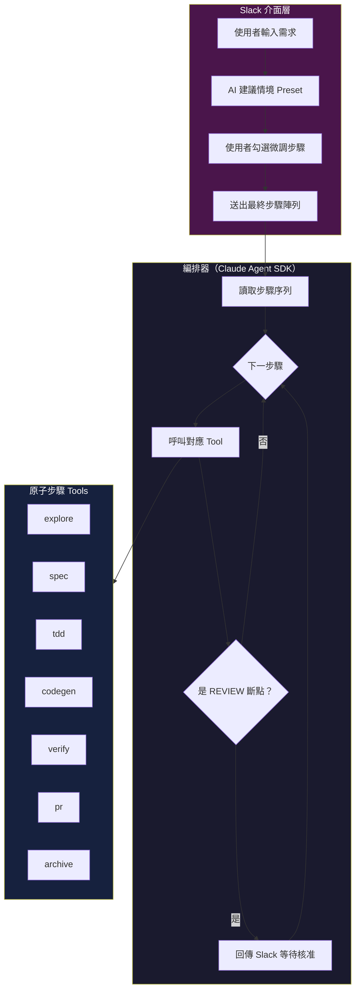
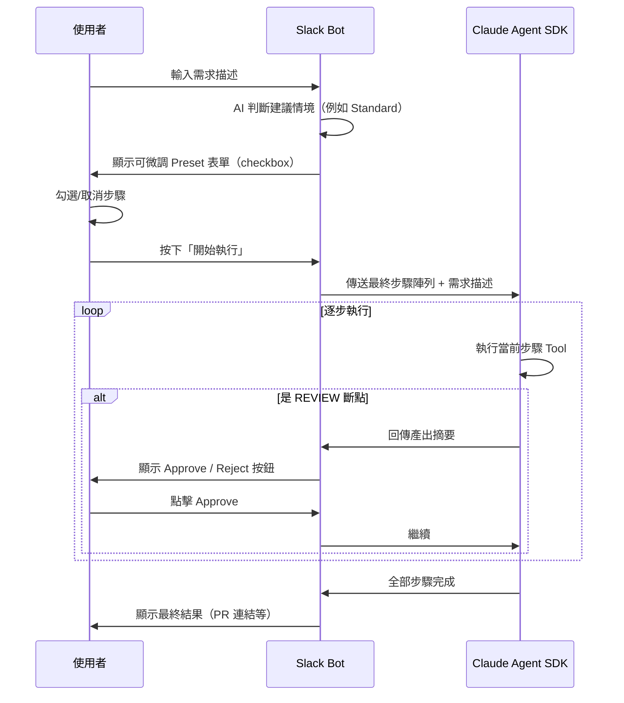
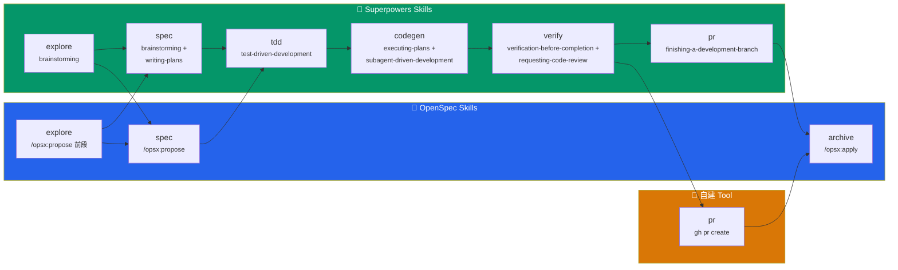

# AI Coding Agent：原子步驟實作規格

> [!abstract] 文件目的
> 這份文件定義了 Slack → Claude Agent SDK 動態工作流系統中，每一個**原子步驟（Atomic Step）**的職責、Input/Output、歸屬框架與實作細節。
> 請開發團隊以此為基底，逐步實作每個 Tool Definition。

**前置閱讀：** [[企業級AI_Coding_Agent_架構設計]]

---

## 整體架構回顧



> [!important] Preset 是建議，不是硬性約束
> 使用者可以在 Slack 表單中自由勾選/取消任何步驟。Preset 只負責提供合理的預設勾選。編排器和 Tool 層只看最終送出的步驟陣列，不關心它來自哪個 Preset 或是否被微調過。

---

## 原子步驟 × 真實 Skill 對照表

每個步驟對應到 OpenSpec / Superpowers 的**真實 skill 名稱**，開發時直接參考這些 skill 的行為來實作 Tool：

| 原子步驟 | 歸屬 | 對應的真實 Skill | 說明 |
|---------|------|-----------------|------|
| `explore` | OpenSpec + Superpowers | `/opsx:propose`（前半段探索）+ `superpowers:brainstorming`（需求釐清） | 兩者都有探索能力，我們抽出來作為獨立步驟 |
| `spec` | OpenSpec + Superpowers | `/opsx:propose`（產出 proposal/specs/design/tasks）+ `superpowers:brainstorming`（蘇格拉底式設計問答）+ `superpowers:writing-plans`（任務拆解） | ==三個 skill 合併為一次 REVIEW 斷點== |
| `tdd` | Superpowers | `superpowers:test-driven-development`；Hotfix 情境另加 `superpowers:systematic-debugging` | TDD 是 Superpowers 的核心紀律 |
| `codegen` | Superpowers | `superpowers:executing-plans`（單一任務）+ `superpowers:subagent-driven-development`（並行執行多個子任務） | 大型任務用 subagent 並行 |
| `verify` | Superpowers | `superpowers:verification-before-completion`（自我檢查）+ `superpowers:requesting-code-review`（品質審查） | 兩個 skill 合併為一次 REVIEW 斷點 |
| `pr` | Superpowers + 自建 | `superpowers:finishing-a-development-branch`（決定 merge/PR 策略）+ `superpowers:using-git-worktrees`（分支隔離） | worktree 在流程最初就建立，PR 步驟收尾；目前僅保留 Git/GitHub 向整合 |
| `archive` | OpenSpec | `/opsx:apply`（將 changes 合回主規格庫） | OpenSpec 的規格生命週期終點 |

---

## 情境 × 步驟對照矩陣

快速查看哪個情境用到哪些步驟，以及哪些步驟是 `[REVIEW]` 斷點：

| 步驟         | 真實 Skill                                                    | Epic | Standard | Hotfix | Refactoring | PoC |    斷點     |
| ---------- | ----------------------------------------------------------- | :--: | :------: | :----: | :---------: | :-: | :-------: |
| `explore`  | `/opsx:propose` + `brainstorming`                           |  ✅   |    —     |   —    |      ✅      |  ✅  |     —     |
| `spec`     | `/opsx:propose` + `brainstorming` + `writing-plans`         | ✅🔍  |   ✅🔍    |   —    |     ✅🔍     |  —  | 🔍 REVIEW |
| `tdd`      | `test-driven-development`                                   |  ✅   |    —     |   ✅    |      ✅      |  —  |     —     |
| `codegen`  | `executing-plans` + `subagent-driven-development`           |  ✅   |    ✅     |   ✅    |      ✅      |  ✅  |     —     |
| `verify`   | `verification-before-completion` + `requesting-code-review` | ✅🔍  |   ✅🔍    |  ✅🔍   |     ✅🔍     |  —  | 🔍 REVIEW |
| `pr`       | `finishing-a-development-branch`                            |  ✅   |    ✅     |   ✅    |      ✅      |  —  |     —     |
| `archive`  | `/opsx:apply`                                               |  ✅   |    ✅     |   —    |      ✅      |  —  |     —     |

> [!tip] 🔍 表示該步驟完成後會暫停，透過 Slack Interactive Message 等待使用者點擊「Approve」才繼續。
> 表格中的 skill 名稱省略了 `superpowers:` 前綴以節省空間。

---

## 原子步驟詳細規格

### Step 1：`explore` — 程式碼庫探索

| 項目 | 內容 |
|------|------|
| **歸屬框架** | ==OpenSpec + Superpowers== |
| **對應真實 Skill** | `/opsx:propose`（前半段的 codebase 探索）+ `superpowers:brainstorming`（需求意圖釐清） |
| **觸發情境** | Epic、Refactoring、PoC |
| **是否為斷點** | 否（產出供後續步驟消費，不需人類核准） |

**職責：**
掃描目標 Repo 的目錄結構、關鍵檔案、技術棧與現有模式，產出一份結構化的現況摘要。

**Input Schema：**
```typescript
interface ExploreInput {
  repo_path: string;           // Repo 根目錄路徑
  focus_area?: string;         // 可選：聚焦掃描的子目錄或模組
  user_description: string;    // 使用者在 Slack 輸入的需求描述
}
```

**Output Schema：**
```typescript
interface ExploreOutput {
  tech_stack: string[];        // 偵測到的技術棧 ["TypeScript", "Express", "PostgreSQL"]
  directory_structure: string; // 精簡的目錄樹（markdown 格式）
  key_files: Array<{          // 與需求相關的關鍵檔案
    path: string;
    relevance: string;        // 為什麼這個檔案重要
  }>;
  existing_patterns: string;  // 現有程式碼中的慣例與模式
  context_summary: string;    // 給後續步驟用的濃縮上下文
}
```

**實作要點：**
- 內部呼叫 File Read + Grep 掃描，**不**用外部 MCP
- `context_summary` 是關鍵產出——後續所有步驟都會參考這份摘要
- Refactoring 情境下，需額外掃描測試覆蓋率與 Legacy 模式

---

### Step 2：`spec` — 撰寫需求規格 🔍 REVIEW

| 項目 | 內容 |
|------|------|
| **歸屬框架** | ==OpenSpec + Superpowers==（三 skill 融合） |
| **對應真實 Skill** | `/opsx:propose`（產出 proposal.md / specs/ / design.md / tasks.md）+ `superpowers:brainstorming`（蘇格拉底式設計問答，確認技術方案）+ `superpowers:writing-plans`（將需求拆解為可執行的任務清單） |
| **觸發情境** | Epic、Standard、Refactoring |
| **是否為斷點** | ✅ 是——規格寫完後暫停，等待人類核准 |

**職責：**
根據使用者需求與 `explore` 的產出，生成結構化的規格文件，寫入 Repo 的 `openspec/changes/` 目錄。

**Input Schema：**
```typescript
interface SpecInput {
  user_description: string;
  explore_output?: ExploreOutput;  // 來自 explore 步驟（如有）
  repo_path: string;
}
```

**Output Schema：**
```typescript
interface SpecOutput {
  change_dir: string;             // 例如 "openspec/changes/add-user-login/"
  files_created: {
    proposal: string;             // proposal.md 的完整路徑
    specs: string[];              // specs/ 下的規格檔案路徑
    design: string;               // design.md 的完整路徑
    tasks: string;                // tasks.md 的完整路徑
  };
  summary: string;                // 給 Slack 顯示的精簡摘要
  scope_in: string[];             // 範圍內項目
  scope_out: string[];            // 範圍外項目（防止 AI 過度幫助）
}
```

**實作要點：**
- 直接讀寫 `openspec/` 目錄下的實體 Markdown 檔案
- `proposal.md` 必須包含 **Out of Scope** 區塊
- `design.md` 須記錄架構決策（選擇 + 理由），參考 [[Claude_Code_OpenSpec_Superpowers_三工具協同開發實戰指南#階段二：Superpowers Brainstorming 細化設計|Brainstorming 流程]]
- Slack 斷點訊息需附上 `proposal.md` 的摘要，讓審核者不需切到 IDE 就能判斷

> [!warning] 關鍵設計決策
> `spec` 步驟同時融合了 OpenSpec 的 Propose 與 Superpowers 的 Brainstorming。
> 原因：在 Slack 情境下，我們不希望使用者經歷兩次獨立的 Review 斷點（一次看規格、一次看設計），而是**合併為一次**：規格 + 設計決策一起審核。

---

### Step 3：`tdd` — 測試驅動開發

| 項目 | 內容 |
|------|------|
| **歸屬框架** | ==Superpowers==（工程紀律核心） |
| **對應真實 Skill** | `superpowers:test-driven-development`（紅-綠-重構循環）；Hotfix 情境額外搭配 `superpowers:systematic-debugging`（系統性定位 Bug 根因） |
| **觸發情境** | Epic、Hotfix、Refactoring |
| **是否為斷點** | 否 |

**職責：**
根據規格（或 Bug 描述），先撰寫測試案例，確認測試是**紅燈（失敗）**狀態後才進入下一步。

**Input Schema：**
```typescript
interface TddInput {
  spec_output?: SpecOutput;        // 來自 spec 步驟（Epic / Refactoring）
  bug_description?: string;        // Hotfix 情境：Bug 描述
  repo_path: string;
  test_framework: string;          // "jest" | "pytest" | "gtest" 等
}
```

**Output Schema：**
```typescript
interface TddOutput {
  test_files_created: string[];    // 新建的測試檔案路徑
  test_run_result: {
    total: number;
    passed: number;
    failed: number;                // 此時應 > 0（紅燈）
    output: string;                // 測試執行的 stdout
  };
  coverage_before?: number;        // Refactoring 情境：改動前的覆蓋率
}
```

**實作要點：**

> [!note] Hotfix 與 Epic/Refactoring 的 TDD 邏輯不同
> - **Hotfix**：寫一個會**重現 Bug** 的測試案例，驗證修完後轉綠
> - **Epic**：根據規格寫**新功能**的測試案例，此時實作不存在所以必紅
> - **Refactoring**：寫**回歸測試**保護現有行為，此時應為綠燈（行為沒變）

- 內部呼叫 `npm test` / `pytest` / `make test` 等本地測試指令
- 測試命名慣例需與 Repo 現有風格一致（由 `explore` 產出判斷）
- Refactoring 情境下 `coverage_before` 是基準線，後續 `verify` 步驟會比對

---

### Step 4：`codegen` — 程式碼生成

| 項目 | 內容 |
|------|------|
| **歸屬框架** | ==Superpowers==（執行層） |
| **對應真實 Skill** | `superpowers:executing-plans`（按 plan 逐步執行）+ `superpowers:subagent-driven-development`（將獨立子任務分派給並行 Sub-agent）；分支隔離由 `superpowers:using-git-worktrees` 在流程啟動時處理 |
| **觸發情境** | 全部 5 種情境 |
| **是否為斷點** | 否 |

**職責：**
根據前序步驟的產出（規格、測試案例、探索摘要），撰寫實作程式碼，目標是讓 `tdd` 步驟的紅燈轉綠。

**Input Schema：**
```typescript
interface CodegenInput {
  repo_path: string;
  spec_output?: SpecOutput;
  tdd_output?: TddOutput;
  explore_output?: ExploreOutput;
  user_description: string;        // 原始需求描述（PoC 情境下可能只有這個）
}
```

**Output Schema：**
```typescript
interface CodegenOutput {
  files_modified: Array<{
    path: string;
    action: "created" | "modified";
    diff_summary: string;          // 精簡的變更描述
  }>;
  test_run_result?: {              // 如果有前序 tdd 步驟，跑一次測試
    total: number;
    passed: number;
    failed: number;
  };
}
```

**實作要點：**
- 這是 Agent 的核心能力——直接用 Claude Agent SDK 的 file write tool
- 如果有 `tdd_output`，寫完程式碼後自動跑一次測試確認紅轉綠
- PoC 情境下沒有規格也沒有測試，Agent 根據 `user_description` + `explore_output` 自由發揮
- 大型任務可拆成多個 Sub-agent 並行（由編排器的 system prompt 控制）

---

### Step 5：`verify` — 自我驗證 🔍 REVIEW

| 項目 | 內容 |
|------|------|
| **歸屬框架** | ==Superpowers==（品管層） |
| **對應真實 Skill** | `superpowers:verification-before-completion`（在宣告完成前強制驗證，跑測試、確認產出）+ `superpowers:requesting-code-review`（對照需求逐項檢查程式碼品質） |
| **觸發情境** | Epic、Standard、Hotfix、Refactoring |
| **是否為斷點** | ✅ 是——驗證報告完成後暫停，等待人類核准 |

**職責：**
對 `codegen` 的產出進行兩階段檢查，生成驗證報告。

**Input Schema：**
```typescript
interface VerifyInput {
  repo_path: string;
  spec_output?: SpecOutput;
  codegen_output: CodegenOutput;
  tdd_output?: TddOutput;
}
```

**Output Schema：**
```typescript
interface VerifyOutput {
  spec_compliance: {               // 階段一：規格合規性
    status: "pass" | "warn" | "fail";
    checklist: Array<{
      requirement: string;
      met: boolean;
      note?: string;
    }>;
  };
  code_quality: {                  // 階段二：程式碼品質
    status: "pass" | "warn" | "fail";
    issues: Array<{
      file: string;
      line?: number;
      severity: "error" | "warning" | "info";
      message: string;
    }>;
  };
  test_result: {                   // 最終測試結果
    total: number;
    passed: number;
    failed: number;
  };
  coverage_after?: number;         // Refactoring：改動後覆蓋率
  summary: string;                 // 給 Slack 顯示的驗證摘要
}
```

**實作要點：**
- **階段一**：逐項比對 `spec_output.scope_in` 清單，確認每條需求都被實作
- **階段二**：檢查命名慣例、錯誤處理、安全漏洞（OWASP Top 10 基本項）
- Refactoring 情境：比對 `coverage_before` vs `coverage_after`，覆蓋率不得下降
- Slack 斷點訊息需包含：通過/失敗狀態 + 摘要 + 問題清單

---

### Step 6：`pr` — 建立 Pull Request

| 項目 | 內容 |
|------|------|
| **歸屬框架** | ==Superpowers + 自建 Tool== |
| **對應真實 Skill** | `superpowers:finishing-a-development-branch`（決定 merge / PR / cleanup 策略）+ 自建 Git CLI 封裝（`gh pr create`） |
| **觸發情境** | Epic、Standard、Hotfix、Refactoring |
| **是否為斷點** | 否 |

**職責：**
將所有變更提交到新分支，並建立 Pull Request。

**Input Schema：**
```typescript
interface PrInput {
  repo_path: string;
  branch_name: string;             // 例如 "feature/add-user-login"
  spec_output?: SpecOutput;
  verify_output: VerifyOutput;
}
```

**Output Schema：**
```typescript
interface PrOutput {
  pr_url: string;                  // PR 連結
  pr_number: number;
  branch: string;
  commits: number;
  files_changed: number;
}
```

**實作要點：**
- 內部呼叫 `git checkout -b` → `git add` → `git commit` → `git push` → `gh pr create`
- PR 描述自動包含：需求摘要、變更檔案清單、測試結果
- commit message 格式遵循 Repo 現有慣例（由 `explore` 偵測）
- Hotfix 情境的 PR 預設 target branch 為 `main`/`master`，其餘為 `develop`

---

### Step 7：`archive` — 規格歸檔

| 項目 | 內容 |
|------|------|
| **歸屬框架** | ==OpenSpec==（規格生命週期管理） |
| **對應真實 Skill** | `/opsx:apply`（將 changes/ 下的變更規格合併回主規格庫 specs/，並歸檔至 archive/） |
| **觸發情境** | Epic、Standard、Refactoring |
| **是否為斷點** | 否 |

**職責：**
將 `openspec/changes/` 下的變更規格合併回 `openspec/specs/`（主規格庫），並將原始 change 移至 `archive/`。

**Input Schema：**
```typescript
interface ArchiveInput {
  change_dir: string;              // 例如 "openspec/changes/add-user-login/"
  repo_path: string;
}
```

**Output Schema：**
```typescript
interface ArchiveOutput {
  specs_updated: string[];         // 更新的主規格檔案路徑
  archived_to: string;             // 歸檔目錄路徑
  commit_hash: string;             // 歸檔 commit 的 hash
}
```

**實作要點：**
- 將 `changes/xxx/specs/` 內容 merge 進 `openspec/specs/`（相同檔案取新版本）
- 將整個 `changes/xxx/` 移至 `changes/archive/xxx-{date}/`
- 獨立一個 git commit：`chore: archive spec for add-user-login`
- 這步驟是 OpenSpec 的 ==Single Source of Truth== 更新機制

---

## Slack 介面層：可微調 Preset 機制

### 設計原則

Preset 是**建議的起點**，不是不可變的流水線。使用者在 Slack 選完情境後，可以自由勾選/取消任何步驟再送出執行。

### Webhook 程式碼範例

```typescript
// ===== 1. Preset 定義：只是預設勾選的步驟陣列 =====
const WORKFLOW_PRESETS: Record<string, string[]> = {
  epic:        ["explore", "spec", "tdd", "codegen", "verify", "pr", "archive"],
  standard:    ["spec", "codegen", "verify", "pr", "archive"],
  hotfix:      ["tdd", "codegen", "verify", "pr"],
  refactoring: ["explore", "spec", "tdd", "codegen", "verify", "pr", "archive"],
  poc:         ["explore", "codegen"],
};

// 所有可用的原子步驟（Slack 表單的 checkbox 選項）
const ALL_STEPS = [
  { id: "explore",  label: "掃描程式碼庫",        hasReview: false },
  { id: "spec",     label: "撰寫規格 [REVIEW]",   hasReview: true  },
  { id: "tdd",      label: "測試先行",            hasReview: false },
  { id: "codegen",  label: "撰寫程式碼",          hasReview: false },
  { id: "verify",   label: "自我驗證 [REVIEW]",   hasReview: true  },
  { id: "pr",       label: "建立 PR",             hasReview: false },
  { id: "archive",  label: "規格歸檔",            hasReview: false },
];

// ===== 2. Slack Interactive Message 生成 =====
function buildWorkflowForm(suggestedPreset: string) {
  const presetSteps = WORKFLOW_PRESETS[suggestedPreset];
  return {
    blocks: [
      {
        type: "section",
        text: { type: "mrkdwn", text: `🔧 建議情境：*${suggestedPreset}*` },
      },
      {
        type: "actions",
        elements: ALL_STEPS.map(step => ({
          type: "checkboxes",
          action_id: `step_${step.id}`,
          options: [{
            text: { type: "mrkdwn", text: `\`${step.id}\` — ${step.label}` },
            value: step.id,
          }],
          // Preset 中有的步驟預設打勾
          initial_options: presetSteps.includes(step.id) ? [{
            text: { type: "mrkdwn", text: `\`${step.id}\` — ${step.label}` },
            value: step.id,
          }] : undefined,
        })),
      },
      {
        type: "actions",
        elements: [
          { type: "button", text: { type: "plain_text", text: "▶ 開始執行" }, action_id: "start_workflow" },
          { type: "static_select", placeholder: { type: "plain_text", text: "切換情境" },
            action_id: "switch_preset",
            options: Object.keys(WORKFLOW_PRESETS).map(k => ({
              text: { type: "plain_text", text: k }, value: k,
            })),
          },
        ],
      },
    ],
  };
}

// ===== 3. 使用者按下「開始執行」後 =====
function onStartWorkflow(userCheckedSteps: string[], userDescription: string) {
  // 不管使用者選的是哪個 preset，最終只看這個陣列
  const workflowConfig = {
    steps: userCheckedSteps,       // e.g. ["spec", "tdd", "codegen", "verify", "pr"]
    description: userDescription,
    // ... repo_path, branch 等其他參數
  };
  
  // 傳給 Claude Agent SDK 編排器
  return invokeAgent(workflowConfig);
}
```

### Slack 互動流程



> [!tip] 為什麼情境判斷也讓 AI 做？
> 使用者輸入「線上有 Bug 要修」，系統可以自動建議 Hotfix preset。使用者輸入「做一個新的報表模組」，建議 Epic preset。這一步用一個輕量的 Claude Haiku 呼叫就能完成，不需要寫 if-else 規則。

---

## 編排器 System Prompt 範本

以下是給 Claude Agent SDK 的編排器 prompt，供團隊作為起點：

```markdown
你是 AI Coding Agent 的工作流編排器。

## 執行規則
1. 你會收到一組有序的步驟清單，每個步驟對應一個 Tool
2. 嚴格按順序執行，不得跳過或重排步驟
3. 每個步驟完成後，將產出存入 context 供後續步驟使用
4. 標記為 [REVIEW] 的步驟完成後，輸出驗證摘要並暫停
5. 暫停時回傳以下格式給 Slack：
   - 步驟名稱 + 狀態
   - 產出摘要（200 字以內）
   - 「Approve」與「Reject + 修改意見」按鈕
6. 收到 Approve 後繼續；收到 Reject 後根據修改意見重新執行該步驟

## 錯誤處理
- 步驟執行失敗：自動重試 1 次
- 重試仍失敗：暫停並通知使用者，附上錯誤訊息

## 當前任務
- 情境：{scenario_name}
- 步驟序列：{steps_json}
- 使用者需求：{user_description}
```

---

## 步驟歸屬總覽



> [!important] 步驟與 Skill 不是一對一
> 注意 `explore` 和 `spec` 步驟各自**橫跨** OpenSpec + Superpowers 兩個框架。這是刻意的設計——在 Slack 場景下，我們把原本需要使用者分別觸發的多個 skill 合併成一個原子步驟 + 一個 REVIEW 斷點，降低互動負擔。

> [!summary] 一句話總結
> OpenSpec 的 `/opsx:propose` + `/opsx:apply` 負責**規格的生與歸**，Superpowers 的 skill 負責**從設計到交付的全部工程紀律**，自建 Tool 目前聚焦在 Git / PR 整合。

---

## 開發順序建議

> [!todo] 團隊 Action Items

**Phase 1 — 最小可行流程（1~2 週）**
- [ ] 實作 `codegen` Tool（核心能力，所有情境都需要）
- [ ] 實作 `pr` Tool（最直接的產出物）
- [ ] 搭建 Slack ↔ Claude Agent SDK 的基本連接
- [ ] 實作 Slack「可微調 Preset 表單」（Interactive Message + checkbox）
- [ ] 用 PoC 情境（`explore` → `codegen`）跑通第一個 E2E

**Phase 2 — 加入規格驅動（2~3 週）**
- [ ] 實作 `explore` Tool
- [ ] 實作 `spec` Tool + Slack REVIEW 斷點 UI
- [ ] 實作 `archive` Tool
- [ ] 用 Standard 情境跑通完整 OpenSpec 流程

**Phase 3 — 加入品質保障（2~3 週）**
- [ ] 實作 `tdd` Tool
- [ ] 實作 `verify` Tool + Slack REVIEW 斷點 UI
- [ ] 用 Epic 情境跑通完整流程（包含 TDD + 雙斷點）

**Phase 4 — 特殊情境與延伸整合（1~2 週）**
- [ ] 驗證 Hotfix 與 Refactoring 情境
- [ ] 壓力測試：並行 Sub-agent 的穩定性

---

*相關筆記：*
- [[企業級AI_Coding_Agent_架構設計]] — 上層架構設計文件
- [[Claude_Code_OpenSpec_Superpowers_三工具協同開發實戰指南]] — 三工具協同概念
- [[真實C++專案實測_四大Claude_Code工作流比較]] — 工作流效能基準參考
