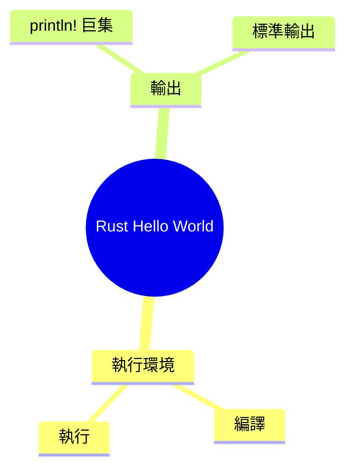
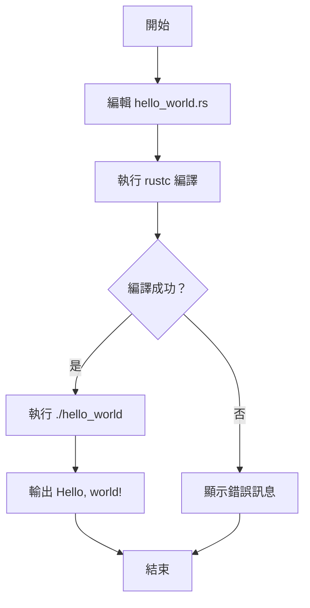

# Rust Hello World 產品需求文件 (PRD)

## 1. 文件資訊

| 欄位 | 內容 |
|-----|-----|
| 產品名稱 | Rust Hello World |
| 文件版本 | V1.0 |
| 編寫日期 | 2026-05-17 |
| 編寫人 | PRD Writer |
| 最後更新 | 2026-05-17 |

## 2. 項目背景

### 2.1 業務目標

驗證 Rust 開發環境正確安裝，並確認第一個程式可成功編譯執行。

### 2.2 目標用戶

| 用戶類型 | 用戶画像 | 核心訴求 |
|---------|---------|---------|
| Rust 初學者 | 剛接觸 Rust 的開發者 | 確認環境可用，學習基本語法 |
| 開發環境驗證者 | 需要驗證編譯器安裝的工程師 | 快速驗證工具鏈正常運作 |

### 2.3 核心價值主張

一行 Rust 程式，輸出 "Hello, world!" 至標準輸出。

## 3. 產品架構

### 3.1 功能架構圖



### 3.2 用戶角色定義

| 角色名稱 | 角色描述 | 主要權限 |
|---------|---------|---------|
| 開發者 | 运行 Rust 程式的使用者 | 編譯、執行、終端輸出 |

## 4. 核心業務流程



## 5. 詳細功能說明

### 5.1 模組：程式執行

#### 5.1.1 編譯程式

| 欄位 | 說明 |
|-----|------|
| **功能編號** | [F-01] |
| **功能描述** | 使用 rustc 將 Rust 源碼編譯為可執行檔案 |
| **前置條件** | 已安裝 Rust toolchain (rustc, cargo) |
| **優先級** | P0 |

**頁面元素**：

| 元素 | 類型 | 說明 | 校驗規則 |
|-----|------|-----|---------|
| 原始碼 | .rs 檔案 | Rust 程式碼 | UTF-8 編碼 |
| 編譯器 | 命令列工具 | rustc | 版本 1.0+ |

**互動邏輯**：

1. 使用者執行 `rustc hello_world.rs`
2. 系統編譯源碼
3. 系統生成可執行檔案 `hello_world`（Linux/macOS）或 `hello_world.exe`（Windows）

**異常處理**：

| 異常場景 | 處理方式 |
|---------|---------|
| 語法錯誤 | rustc 輸出錯誤行號與訊息 |
| 缺少編譯器 | 提示安裝 Rust |

---

#### 5.1.2 執行並輸出

| 欄位 | 說明 |
|-----|------|
| **功能編號** | [F-02] |
| **功能描述** | 執行編譯後的程式，輸出 "Hello, world!" 至標準輸出 |
| **前置條件** | 程式已成功編譯 |
| **優先級** | P0 |

**頁面元素**：

| 元素 | 類型 | 說明 | 校驗規則 |
|-----|------|-----|---------|
| 終端 | 命令列 | 顯示輸出結果 | - |

**互動邏輯**：

1. 使用者執行 `./hello_world`
2. 系統執行可執行檔案
3. `println!` 巨集將 "Hello, world!" 輸出至標準輸出（stdout）
4. 自動換行

**異常處理**：

| 異常場景 | 處理方式 |
|---------|---------|
| 執行權限不足 | 提示 `chmod +x hello_world` |

---

## 6. 非功能需求

### 6.1 效能要求

| 指標 | 要求 |
|-----|------|
| 編譯時間 | < 5 秒 |
| 執行啟動時間 | < 100ms |

### 6.2 安全要求

- [ ] 無網路請求
- [ ] 無檔案系統寫入
- [ ] 無敏感資料處理

### 6.3 兼容性要求

| 維度 | 支援範圍 |
|-----|---------|
| 作業系統 | Linux, macOS, Windows |
| 架構 | x86_64, ARM64 |
| Rust 版本 | 1.0+ |

## 7. 疊代規劃

| 版本 | 包含功能 | 預計上線時間 |
|-----|---------|-------------|
| MVP | 標準輸出 Hello, world! | 2026-05-17 |

## 8. 附錄

### 8.1 術語表

| 術語 | 解釋 |
|-----|-----|
| rustc | Rust 官方編譯器 |
| println! | 標準輸出巨集 |
| stdout | 標準輸出裝置 |

### 8.2 參考文件

- [The Rust Programming Language](https://doc.rust-lang.org/book/)
- [Rust 官方網站](https://www.rust-lang.org/)

---

## 原始碼

```rust
fn main() {
    println!("Hello, world!");
}
```

---

*文件結束*