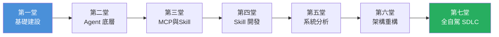

# 🎓 企業級 AI Coding Agent 實戰工作坊

> 從「裸奔 AI」到「全自駕 SDLC」——七堂課打造 AI 協同開發的工程紀律

---

## 📋 課程總覽

| 堂數 | 主題 | 核心能力 | 產出物 |
|:---:|------|---------|--------|
| 1 | 企業級 AI 基礎建設 | CLAUDE.md 架構邊界定義 | 專案 CLAUDE.md |
| 2 | 解構大廠 Agent 底層 | 從 30 行 Python 打造 Agent（6 步漸進） | Agentic Loop 觀察報告 |
| 3 | MCP 與 Skill 原理 | MCP 協議 + Skill 載入機制（擴充 AI 的手和腦） | SDLC MCP+Skill 組合 |
| 4 | 擴充 GitAgent 生態 | Skill 開發與封裝 | 標準 Skill PR |
| 5 | AI 系統分析實戰 | Legacy Code 逆向工程 | YAML 規格文件 |
| 6 | AI 架構重構實戰 | Agentic TDD 迴圈 | Spring Boot 綠燈截圖 |
| 7 | 全自動化 AI SDLC | 端到端 Workflow 閉環 | 完整 Agentic PR |

---

## 🗂️ 課程結構

每堂課 60 分鐘，採「講授 + 動手 + 作業」三段式設計：

| 段落 | 時間 | 內容 |
|------|:---:|------|
| 🎯 講師主講與 Demo | 50 mins | 概念講授 + 即場演示 |
| ⚡ 課堂快速動手 | 10 mins | Quick Win 體驗（佔總分 10%） |
| 📝 回家作業 | 課後 | 結合日常工作的實作任務 |

---

## 🛠️ 環境需求

### 必備工具

| 工具 | 版本 | 用途 |
|------|------|------|
| **Claude Code** | 最新版 | 主要 AI Agent |
| **Node.js** | ≥ 20.19.0 | OpenSpec 與 MCP 運行環境 |
| **Git** | ≥ 2.40 | 版控與 Skill 管理 |
| **Java 17+** | JDK 17 | 第六堂 Spring Boot 實作 |
| **Maven** | ≥ 3.9 | Spring Boot 專案建置 |

### 安裝指令

```bash
# Claude Code（macOS/Linux）
curl -fsSL https://claude.ai/install.sh | bash

# OpenSpec
npm install -g @fission-ai/openspec@latest

# 驗證安裝
claude --version
node --version
openspec --version
```

### 建議設定

```json
// .claude/settings.json
{
  "permissions": {
    "allow": ["Bash:npm:*", "Bash:git:*", "Bash:mvn:*", "Bash:kubectl:*"],
    "deny": ["Bash:rm -rf *", "Bash:sudo *"]
  }
}
```

---

## 📁 課程教材目錄

```
ai workshop/
├── README.md                          ← 你在這裡
├── 01_企業級AI基礎建設.md              ← 第一堂
├── 02_解構大廠Agent底層.md            ← 第二堂
├── 03_MCP與Skill原理.md              ← 第三堂
├── 04_擴充GitAgent生態.md             ← 第四堂
├── 05_AI系統分析實戰.md               ← 第五堂
├── 06_AI架構重構實戰.md               ← 第六堂
├── 07_全自動化AI_SDLC.md              ← 第七堂
└── materials/                         ← 補充材料
    ├── demo-scripts/                  ← Demo 腳本
    ├── quick-wins/                    ← Quick Win 指令卡
    └── templates/                     ← 範本檔案
```

---

## 🎯 學習路徑



### 階段目標

| 階段 | 堂數 | 目標 |
|------|------|------|
| **🏗️ 基礎建設** | 1-2 | 理解 AI Agent 架構，建立專案規範 |
| **🔧 工具擴充** | 3-4 | 打造團隊專屬 MCP 與 Skill 生態 |
| **⚡ 實戰應用** | 5-7 | 從逆向工程到全自動化 SDLC 閉環 |

---

## 📊 評分方式

| 項目 | 比重 | 說明 |
|------|:---:|------|
| 課堂 Quick Win | 10% | 每堂課 10 分鐘實作 |
| 回家作業 | 60% | 7 次作業（第四堂 Skill PR 為重點） |
| 結業挑戰 | 30% | 第七堂全流程實作 |

---

*準備好了嗎？從 [第一堂：企業級 AI 基礎建設](01_企業級AI基礎建設.md) 開始吧！*