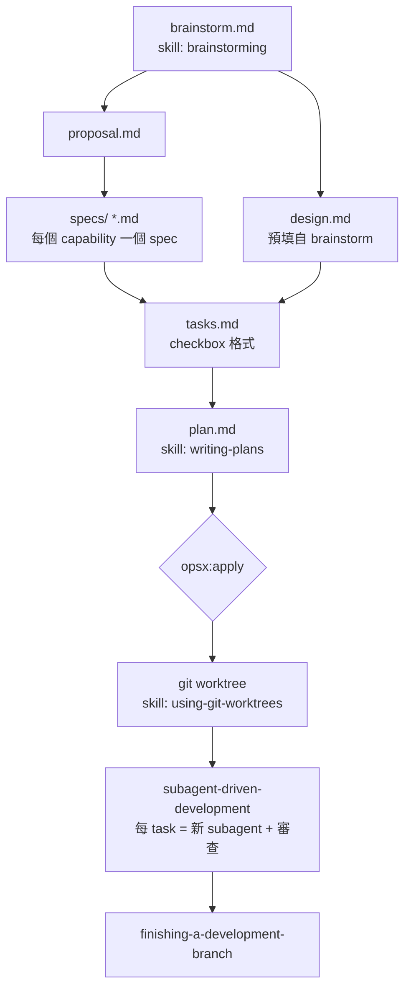

# OpenSpec + Superpowers 整合工作流

> [!tip] 本筆記摘要
> 記錄如何將 **OpenSpec**（變更管理）與 **Superpowers**（AI 技能庫）整合成一套完整的 AI 驅動開發工作流，以自製的 `sdd-plus-superpowers` schema 為核心，實現從構思到實作的全自動化。

## 背景：兩個工具的組合

| 工具 | 核心問題 | 類比 |
|------|----------|------|
| **OpenSpec** | 「改了什麼」 | 施工變更單 |
| **Superpowers** | 「怎麼幹」 | 施工隊工作手冊 |

兩者分工明確——**OpenSpec 管流程框架，Superpowers 提供執行技能**。

---

## 核心概念

### OpenSpec：變更管理框架

OpenSpec 是以「變更（change）」為單位的 spec-driven 開發工具。每個變更包含一系列 **artifacts**，依序產出：

```
proposal → specs → design → tasks 
```

透過 schema 定義每個 artifact 的：
- 產出路徑（`generates`）
- 依賴關係（`requires`）
- AI 執行指令（`instruction`）

### Superpowers：AI 技能庫

Superpowers 提供一組可呼叫的 AI skills，每個 skill 是一份詳細的「工作手冊」，告訴 AI 如何完成特定任務：

| Skill | 功能 |
|-------|------|
| `superpowers:brainstorming` | 互動式設計探索，提問 → 提案 → 確認 |
| `superpowers:writing-plans` | 將任務分解為 2-5 分鐘微步驟 |
| `superpowers:subagent-driven-development` | 每個 task 派發獨立 subagent 執行 + 兩階段審查 |
| `superpowers:using-git-worktrees` | 建立隔離的 git worktree 工作空間 |
| `superpowers:finishing-a-development-branch` | 完成 branch：驗測 → 合併/PR → 清理 |

---

## sdd-plus-superpowers Schema

**GitHub：** [JiangWay/OpenSpec — schemas/sdd-plus-superpowers](https://github.com/JiangWay/OpenSpec/tree/6449135b7ca301bf7d19a6c9cb3c331c051205f3/schemas/sdd-plus-superpowers)
**Schema 定義：** [schema.yaml](https://github.com/JiangWay/OpenSpec/blob/6449135b7ca301bf7d19a6c9cb3c331c051205f3/schemas/sdd-plus-superpowers/schema.yaml)

這個自製 schema 是整合的關鍵，它把 Superpowers skills **嵌入** OpenSpec 的 artifact 指令中：

```yaml
name: sdd-plus-superpowers
version: 1
description: >
  Spec-driven workflow integrated with Superpowers skills.
  brainstorm → proposal → design/specs → tasks → plan.
  Apply phase uses git worktrees + subagent-driven development.
```

### Artifact 流程圖



### Apply 階段的執行架構

```
opsx:apply
  └─ superpowers:using-git-worktrees
       └─ 建立 feature branch + worktree
  └─ superpowers:subagent-driven-development
       └─ 每個 Task：
            ├─ Implementer subagent（haiku 模型）
            ├─ Spec compliance reviewer
            └─ Code quality reviewer
  └─ superpowers:finishing-a-development-branch
       └─ merge / PR / cleanup
```

---

## 實戰示範：行事曆 App

### 執行命令序列

```bash
/opsx:ff --schema sdd-plus-superpowers   # Fast-forward：自動建立所有 artifacts
/opsx:apply                               # 執行實作
/opsx:archive                             # 歸檔並同步 specs
```

### 對話流程（`/opsx:ff`）

1. **brainstorm**：呼叫 `superpowers:brainstorming`
   - 詢問：平台？→ Web
   - 詢問：使用對象？→ 個人
   - 詢問：功能？→ 新增/編輯/刪除事件
   - 視覺輔助展示三種版面（月曆/週曆/清單）→ 選週曆
   - 提案三種技術方案 → 選純前端 + localStorage
   - 設計確認：週曆格線 UI mockup
2. **design.md**：從 brainstorm 自動預填（架構、資料模型、UI）
3. **proposal.md**：提取 Why/What/Capabilities（3 個新 capability）
4. **specs/**：每個 capability 一個 spec 檔（SHALL/MUST + 場景）
5. **tasks.md**：7 組 24 個任務
6. **plan.md**：呼叫 `superpowers:writing-plans`，產出含完整程式碼的微步驟

### 產出的 Capabilities

| Capability | 說明 |
|-----------|------|
| `weekly-calendar-view` | 週曆格線、今天高亮、週次導覽 |
| `event-crud` | 事件新增/編輯/刪除、表單驗證、並排顯示 |
| `event-persistence` | localStorage 讀寫、資料結構 schema |

### 技術細節（行事曆 App）

- **Tech Stack：** HTML5 + CSS3 + Vanilla JS（無框架、無建構工具）
- **Theme：** Catppuccin Mocha 深色
- **資料：** `localStorage`，key = `calendar_events`，UUID v4 識別
- **事件欄位：** `{ id, title, date, startTime, endTime, color }`
- **重疊處理：** 同日時間重疊的事件並排等寬顯示

### 修復的 Bug（由最終 code reviewer 發現）

> [!bug] 關鍵 Bug
> **Timezone Bug：** `formatDate()` 使用 `toISOString()` 回傳 UTC，在 UTC+8 時區會造成日期偏差一天。
> **修復：** 改用 `getFullYear()` / `getMonth()` / `getDate()` 本地時間格式化。

> [!warning] 邊界案例
> 點擊 23:00 時間格時，`endTime` 預填為相同的 23:00，導致驗證失敗無法儲存。
> **修復：** `h + 1 >= 24 ? '23:59' : ...`

---

## 整合效益

### 為什麼組合比單獨使用更好？

| 單獨使用 Superpowers | 單獨使用 OpenSpec | 組合（sdd-plus-superpowers） |
|---------------------|-------------------|------------------------------|
| Skill 執行但沒有結構化產出追蹤 | 需要手動填寫所有 artifacts | **Skill 自動填寫 artifacts** |
| 無法追蹤 task 進度 | 沒有 AI 輔助執行 | **OpenSpec 追蹤 + Superpowers 執行** |
| 設計文件散落各處 | 設計流程需手動觸發 | **統一在 `openspec/changes/` 管理** |

### 工作流優點

- **Fast-forward（`/opsx:ff`）**：一個指令從零到實作就緒
- **隔離執行（worktree）**：每個 change 有獨立 branch，不污染 main
- **品質把關（兩階段審查）**：每個 task 完成後有 spec compliance + code quality 雙重 review
- **自動歸檔（`/opsx:archive`）**：完成後 specs 同步到主目錄，change 歸檔保存

---

## 相關連結

- [OpenSpec GitHub](https://github.com/JiangWay/OpenSpec)
- [sdd-plus-superpowers schema](https://github.com/JiangWay/OpenSpec/tree/6449135b7ca301bf7d19a6c9cb3c331c051205f3/schemas/sdd-plus-superpowers)
- [schema.yaml 原始碼](https://github.com/JiangWay/OpenSpec/blob/6449135b7ca301bf7d19a6c9cb3c331c051205f3/schemas/sdd-plus-superpowers/schema.yaml)

---

## 使用方式快速參考

```bash
# 安裝 OpenSpec（假設已有 openspec CLI）
# 在專案中新建 change
openspec new change "your-feature" --schema sdd-plus-superpowers

# Fast-forward：自動建立所有 artifacts（含互動式 brainstorm）
/opsx:ff --schema sdd-plus-superpowers

# 執行實作
/opsx:apply

# 完成後歸檔（含 spec sync）
/opsx:archive
```

> [!note] Schema 位置
> 本地 schema 複製到 `openspec/schemas/sdd-plus-superpowers/schema.yaml`，OpenSpec 會自動識別。
