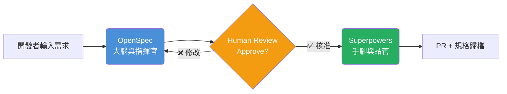
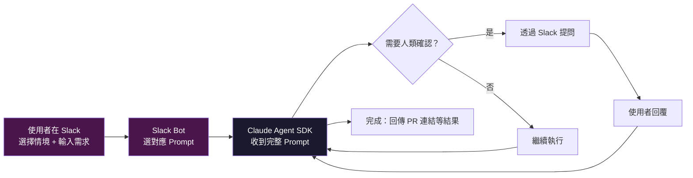

# 企業級 AI Coding Agent：動態工作流與本地技能架構設計

> [!abstract] 這份文件是什麼
> 為讓全公司開發團隊將 AI 輔助開發從「個人工具」升級為「團隊標準化流程」所設計的完整架構提案。
> 可直接作為：**內部分享簡報底稿 / 架構提案 Proposal / 系統開發規格書 Spec**。

---

## 一、核心設計理念

本系統捨棄傳統僵化的 Chatbot 形式，改採兩大核心設計：

- **Generative UI（生成式介面）**：介面根據任務動態渲染，不是固定表單
- **Dynamic Workflow（動態工作流）**：開發者根據任務規模自由組裝執行步驟

以 ==Claude Agent SDK== 作為執行引擎，結合團隊既有的版控與 CI/CD 生態系，讓開發者在 Slack 選擇情境後，AI 收到**一個完整的情境 Prompt**，自主完成從規格定義到 PR 建立的端到端流程。

---

## 二、底層架構：Local Native Skills 驅動

> [!important] 關鍵架構決策
> 本系統**明確拒絕**用 MCP（Model Context Protocol）處理本地端或緊密耦合的工具操作。全面改用速度最快、權限最清晰的 **Local Native Skills / CLI 封裝**。

### 三大技術支柱

**1. 本地檔案操作（File System Tools）**
Agent 直接讀寫 Repo 內的實體 Markdown 檔案（`proposal.md`、`specs/`），作為 ==Single Source of Truth==。不透過任何中介層。

**2. 原生 CLI 整合（CLI Tools）**
拋棄肥重的外部 Connector。優先將 Git 操作、PR 建立與本地測試（`npm test`）封裝為 Agent Tool。企業內部票務系統整合（例如 ADO）暫不納入首波實作，避免主流程過早耦合外部平台。

**3. 狀態機與 Human-in-the-loop**
Agent 不會盲目執行到底。在==重要節點==（如規格與設計產出完成後）主動中斷，將產出回傳介面，等待開發者點擊「**Approve & Continue**」後才進入下一階段。

---

## 三、工作流引擎：OpenSpec × Superpowers 分工



| 角色 | 工具 | 負責範疇 |
|------|------|---------|
| **大腦與指揮官** | [[Claude_Code_OpenSpec_Superpowers_三工具協同開發實戰指南\|OpenSpec]] | 探索現況、產出結構化規格、拆解任務為 Checklist |
| **手腳與品管** | Superpowers | TDD 執行、Code Gen、Sub-agent 自我驗證、確保實作符合規格 |

> [!tip] 設計哲學
> ==規劃與執行完全拆分==。OpenSpec 說「做什麼」，Superpowers 決定「怎麼做」。兩者之間有人類的 Review 斷點，確保方向不偏。

---

## 四、5 大核心工作流情境

### 設計原則：5 種情境 = 5 個 Prompt

> [!important] 架構教訓（2026-04-06 實測結論）
> 原本設計「原子步驟 + 外部編排器」方案，讓 Slack bot 判斷 step 完成狀態再進下一步。==實測證明完全不可行==——chatbot 只是傳話的，它沒有能力判斷 AI 產出是否代表某個步驟已完成。
>
> **正確做法**：每個情境對應一個完整的 Prompt，Slack bot 只負責「選情境 → 丟 prompt → 轉發結果」，所有流程編排由 Claude Agent SDK 在 prompt 內自主判斷。

開發者在 Slack 選擇情境後，系統將對應的 **Scenario Prompt** 連同使用者需求一起送給 Claude Agent SDK。AI 自主完成整個流程，只在需要人類確認時透過 Slack 回傳問題。



### 情境總覽

| 情境 | 適用時機 | 執行步驟 |
|------|---------|---------|
| **Epic / Feature** | 大型新功能，需嚴謹文件與完整追蹤 | 探索 → 寫規格 → TDD → 寫程式 → 驗證 → PR → 歸檔 |
| **Standard** | 日常 User Story，目標明確 | 寫規格 → 任務拆解 → 寫程式 → 驗證 → PR → 歸檔 |
| **Hotfix** | 線上突發 Bug，追求速度 | 寫測試（重現 Bug）→ 寫程式（修復）→ 驗證 → PR |
| **Refactoring** | Legacy Code 現代化改造 | 探索 → 寫規格（新架構）→ 寫測試（回歸）→ 寫程式 → 驗證 → PR → 歸檔 |
| **PoC** | 新技術試驗，快速打樣 | 探索 → 寫程式 |

---

### 情境 1：功能開發（Epic / Feature）🔥 火力全開

> [!example] 適用場景
> 從零開始規劃大型新功能，需要嚴謹文件與完整的 TDD 保障。

**執行流程：**
```
[探索] → [寫規格] → [任務拆解] → [TDD] → [寫程式] → [自我驗證] → [PR] → [規格歸檔]
```

OpenSpec 處理完規格與任務拆解後，完整交棒給 Superpowers 逐步執行。每個節點都有 Human Review 斷點。

---

### 情境 2：標準開發（Standard）⚡ 日常主力

> [!example] 適用場景
> 日常 User Story 或單一模組修改，需求已明確，不需要深度腦力激盪。

**執行流程：**
```
[寫規格] → [任務拆解] → [寫程式] → [自我驗證] → [PR] → [規格歸檔]
```

跳過耗時的前期探索與 TDD，直接由規格驅動實作，但==保留嚴格的自我驗證 QA 關卡==。

---

### 情境 3：緊急修復（Hotfix）🚨 極速模式

> [!warning] 適用場景
> 線上突發 Bug 或單純邏輯錯誤。關閉所有文件生成作業，追求極致速度。

**執行流程：**
```
[寫測試（重現 Bug）] → [寫程式（修復）] → [自我驗證] → [PR]
```

直接啟動 Superpowers 撰寫會報錯的 Test Case，精準修復後立即發 PR。**不產生任何 OpenSpec 文件。**

---

### 情境 4：舊系統重構（Refactoring）🏗️ 外科手術

> [!example] 適用場景
> 將臃腫的 Legacy Code 轉換為現代化架構。重點在梳理舊邏輯與建立測試防護網。

**執行流程：**
```
[探索（掃描舊 Code）] → [寫規格（定義新架構）] → [寫測試（回歸測試）] → [寫程式] → [自我驗證] → [PR] → [規格歸檔]
```

故意跳過任務拆解，因為重構的重點是==行為一致性驗證==，而非開細碎的工單。

---

### 情境 5：技術打樣（PoC）🧪 草稿模式

> [!example] 適用場景
> 試驗新技術或驗證 API 串接。不留技術債的快速試錯。

**執行流程：**
```
[探索] → [寫程式]
```

無拘無束。跳過所有文件、開票與測試，專注利用 AI 快速產出可運行的 Prototype。**產出物不進主線，驗證完即丟。**

---

## 五、架構決策摘要

| 決策點 | 選擇 | 理由 |
|--------|------|------|
| 是否使用 MCP 做本地操作 | ❌ 否 | 速度慢、權限難控、除錯困難 |
| AI 框架 | Claude Agent SDK | 原生支援 Sub-agent 與工具呼叫 |
| 規格管理 | OpenSpec（實體 Markdown 檔案） | 版控友善、可追溯、AI 可直接讀寫 |
| 外部平台整合策略 | 首波不整合 ADO，先聚焦 Git / PR / 測試 | 降低耦合與驗證成本，優先跑通核心工作流 |
| 人工介入點 | Prompt 內指示 AI 在關鍵節點暫停提問 | 防止 AI 盲目執行、保留決策權 |
| 編排方式 | 5 個情境 Prompt（非原子步驟組裝） | Chatbot 無法判斷 step 完成狀態，編排必須在 prompt 內 |

---

## 六、下一步行動

- [ ] 撰寫 5 個情境 Prompt（參考 [[AI_Coding_Agent_情境Prompt實作規格]]）
- [ ] 搭建 Slack Bot → Claude Agent SDK 的 Prompt 派發機制
- [ ] 確認 Claude Agent SDK 版本與 Sub-agent 並行上限
- [ ] 定義 Git / PR 相關 Agent Tool 的介面規格
- [ ] 挑選一個 Pilot 功能跑完 Standard 情境的完整流程
- [ ] 根據 Pilot 結果調整 Prompt 內容

---

*相關筆記：*
- [[AI_Coding_Agent_情境Prompt實作規格]] — 5 個情境 Prompt 的實作細節
- [[Claude_Code_OpenSpec_Superpowers_三工具協同開發實戰指南]]
- [[真實C++專案實測_四大Claude_Code工作流比較]]
- ~~[[AI_Coding_Agent_原子步驟實作規格]]~~ — 已棄用，原子步驟 + 外部編排器方案不可行
